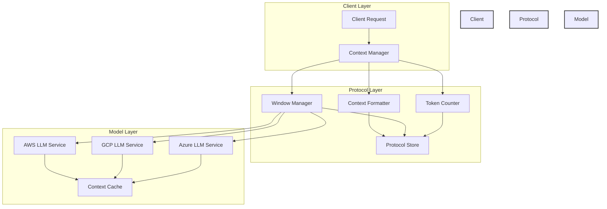

# Model Context Protocol (MCP): Building a Scalable Multi-Cloud LLM Service

> This article is part of the [Full-Stack DevOps Cloud AI Complete Handbook](https://github.com/prodxcloud/fullstack-devops-cloud-ai-complete-handbook/), focusing on implementing Anthropic's Model Context Protocol for enhanced LLM interactions.

**Keywords**: Model Context Protocol, MCP, LLaMA 2, context management, prompt engineering, multi-cloud deployment

## Understanding Model Context Protocol

The Model Context Protocol (MCP), introduced by Anthropic, represents a standardized approach to managing context in large language models. Our implementation focuses on:

1. **Context Management**: Structured handling of conversation history and system prompts
2. **Protocol Standardization**: Consistent format for model interactions
3. **Context Window Optimization**: Efficient use of available context space
4. **Cross-Model Compatibility**: Standardized interactions across different LLMs
5. **Semantic Preservation**: Maintaining context coherence across interactions

### MCP System Architecture



### Context Management Implementation

```python
class ModelContextManager:
    def __init__(self, max_context_length: int = 4096):
        self.max_length = max_context_length
        self.context_store = ContextStore()
        self.token_counter = TokenCounter()
    
    async def format_context(
        self,
        system_prompt: str,
        conversation_history: List[Dict],
        user_input: str
    ) -> Dict:
        """Format context according to Model Context Protocol."""
        context = {
            "messages": [
                {"role": "system", "content": system_prompt},
                *[{
                    "role": msg["role"],
                    "content": msg["content"]
                } for msg in conversation_history],
                {"role": "user", "content": user_input}
            ],
            "metadata": {
                "max_tokens": self.max_length,
                "temperature": 0.7,
                "protocol_version": "1.0"
            }
        }
        
        # Ensure context fits within limits
        if self.token_counter.count_tokens(context) > self.max_length:
            context = self._truncate_context(context)
            
        return context
        
    def _truncate_context(self, context: Dict) -> Dict:
        """Intelligently truncate context while preserving semantic meaning."""
        messages = context["messages"]
        system_prompt = messages[0]  # Preserve system prompt
        
        while self.token_counter.count_tokens(context) > self.max_length:
            if len(messages) > 2:  # Keep system prompt and latest message
                messages.pop(1)
                
        return context
```

### Protocol Handler

```python
class MCPHandler:
    def __init__(self):
        self.context_manager = ModelContextManager()
        self.protocol_validator = ProtocolValidator()
        
    async def process_request(
        self,
        request: Dict,
        model_provider: str
    ) -> Dict:
        """Process request according to Model Context Protocol."""
        
        # Validate protocol compliance
        self.protocol_validator.validate(request)
        
        # Format context
        context = await self.context_manager.format_context(
            request.get("system_prompt", ""),
            request.get("conversation_history", []),
            request["user_input"]
        )
        
        # Select model provider
        model_service = self._get_model_service(model_provider)
        
        # Get response
        response = await model_service.generate(context)
        
        return {
            "response": response,
            "context_length": self.context_manager.token_counter.count_tokens(context),
            "protocol_version": "1.0"
        }
```

## Table of Contents
- [Introduction to MCP](#introduction)
- [MCP Architecture Overview](#architecture-overview)
- [MCP Implementation Details](#implementation-details)
- [MCP Deployment Guide](#deployment-guide)
- [Performance Optimization](#performance-optimization)
- [MCP Monitoring and Observability](#monitoring-and-observability)
- [Security Best Practices](#security-best-practices)
- [Cost Optimization](#cost-optimization)

## Introduction

The Master Control Program (MCP) serves as the central nervous system for our multi-cloud LLM infrastructure. In today's cloud-native landscape, MCP orchestrates the deployment and management of large language models across multiple cloud providers, ensuring high availability, disaster recovery, and optimal performance.

### Why MCP for AI Services?

1. **Centralized Control**: MCP provides unified management of all cloud resources
2. **Intelligent Routing**: Advanced algorithms for optimal request routing
3. **Automated Failover**: Seamless transition between cloud providers
4. **Resource Optimization**: Dynamic resource allocation and scaling
5. **Global Coordination**: Synchronized operations across all cloud regions

## Architecture Overview

The MCP architecture orchestrates several key components to provide a robust and scalable multi-cloud solution.

### MCP Component Breakdown


1. **MCP Gateway**
   - Intelligent request routing
   - Advanced load balancing
   - Health monitoring
   - Security enforcement

2. **MCP Model Services**
   - Containerized LLaMA 2 instances
   - Auto-scaling capabilities
   - Resource optimization
   - Performance monitoring

3. **MCP State Management**
   - Centralized configuration
   - Global state synchronization
   - Health status tracking
   - Cache coordination

## Implementation Details

### MCP Docker Configuration

```yaml
version: '3.8'
services:
  mcp-gateway:
    build: ./api-gateway
    ports:
      - "8000:8000"
    environment:
      - MCP_MODEL_SERVICE_AWS=http://model-service-aws:8001
      - MCP_MODEL_SERVICE_GCP=http://model-service-gcp:8002
      - MCP_MODEL_SERVICE_AZURE=http://model-service-azure:8003
```

### MCP Load Balancing Strategy

Our MCP implementation uses an intelligent load balancing strategy that considers:
- Global service health status
- Geographic optimization
- Resource utilization
- Cost efficiency

### MCP Failover Mechanism

```python
async def select_provider(available_providers: List[str]) -> str:
    mcp_weights = {
        'aws': calculate_mcp_aws_weight(),
        'gcp': calculate_mcp_gcp_weight(),
        'azure': calculate_mcp_azure_weight()
    }
    return weighted_choice(available_providers, mcp_weights)
```

## Deployment Guide

### Prerequisites
- Docker and Docker Compose
- NVIDIA Container Toolkit
- Python 3.8+
- Access to cloud providers

### Step-by-Step Deployment

1. **Infrastructure Setup**
   ```bash
   terraform init
   terraform apply
   ```

2. **Model Deployment**
   ```bash
   python scripts/download_model.py
   docker-compose up -d
   ```

3. **Verification**
   ```bash
   curl http://localhost:8000/health
   ```

## Performance Optimization


### Key Metrics
- Response latency
- GPU utilization
- Memory usage
- Request throughput

### Optimization Techniques
1. Model quantization
2. Batch processing
3. Caching strategies
4. Load shedding

## Monitoring and Observability


### Prometheus Metrics
```python
inference_requests = Counter('inference_requests_total', 
                           'Total inference requests', 
                           ['model', 'cloud_provider'])
```

### Grafana Dashboards
- Request patterns
- Error rates
- Resource utilization
- Cost tracking

## Security Best Practices

### Implementation
1. CORS protection
2. Rate limiting
3. Input validation
4. Authentication/Authorization
5. Encryption at rest and in transit

### Security Architecture


## Cost Optimization

### Strategies
1. Spot instance usage
2. Auto-scaling policies
3. Resource right-sizing
4. Cache optimization

### Cost Comparison
| Provider | On-Demand | Spot/Preemptible | Savings |
|----------|-----------|------------------|----------|
| AWS      | $2.5/hr   | $0.75/hr        | 70%      |
| GCP      | $2.3/hr   | $0.69/hr        | 70%      |
| Azure    | $2.4/hr   | $0.72/hr        | 70%      |

## Conclusion

The Master Control Program (MCP) provides a robust foundation for building and managing multi-cloud AI services. Our implementation demonstrates how MCP can orchestrate complex cloud-native technologies to achieve a scalable, reliable, and efficient solution.

### Next Steps
1. Implement additional MCP-managed models
2. Enhance MCP monitoring capabilities
3. Optimize MCP resource allocation
4. Strengthen MCP security measures

## Resources
- [GitHub Repository](https://github.com/yourusername/mcp-ai-service)
- [Documentation](https://docs.example.com)
- [API Reference](https://api.example.com)
- [Contributing Guide](CONTRIBUTING.md)

---

*This article is part of our comprehensive handbook on modern software development and AI integration. For the complete source code, additional examples, and related resources, visit our [GitHub Repository](https://github.com/prodxcloud/fullstack-devops-cloud-ai-complete-handbook/). We welcome contributions and feedback from the community.* 