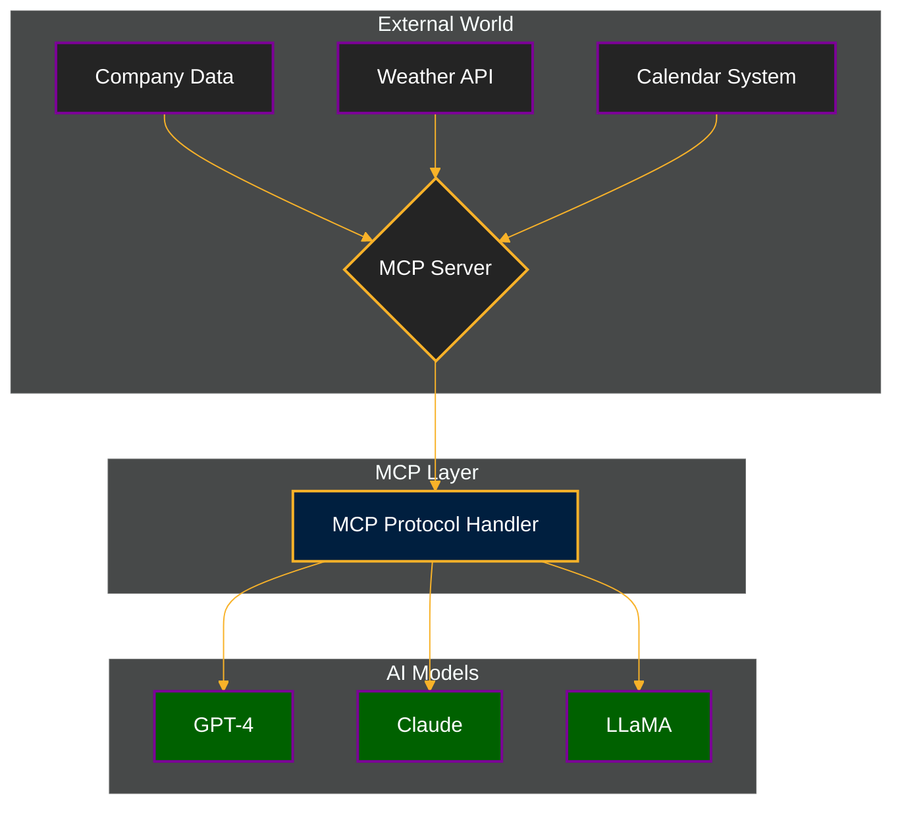
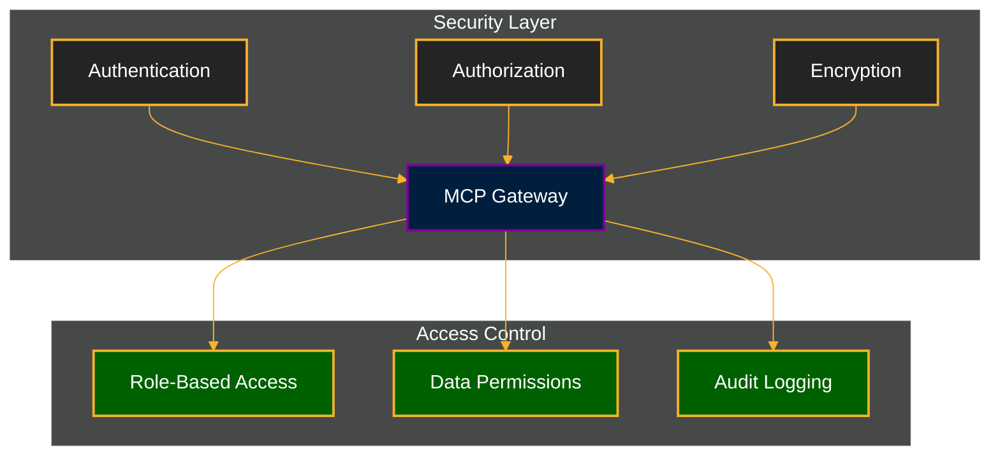
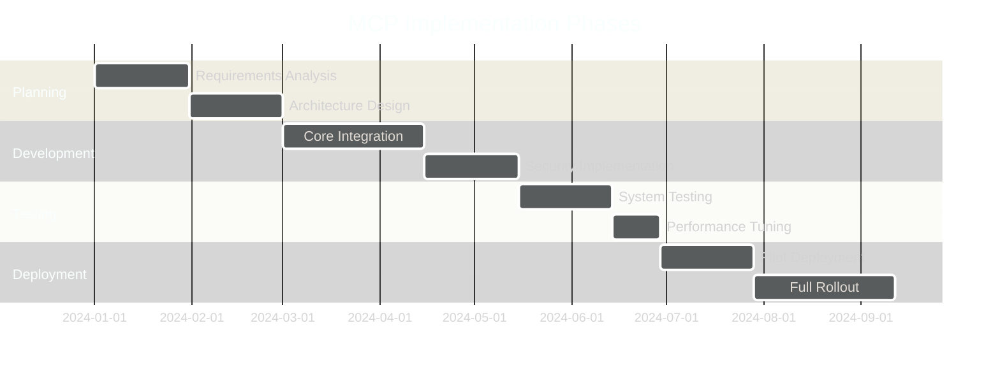

The Universal Translator for AI: A Deep Dive into the Model Context Protocol (MCP)

SEO Description 1: "Discover how Anthropic's Model Context Protocol (MCP) revolutionizes AI integration by providing a universal standard for connecting AI models with external data sources and tools."

SEO Description 2: "Learn how MCP acts as the 'USB-C for AI integrations,' simplifying the way AI assistants interact with databases, APIs, and enterprise systems."

SEO Description 3: "Explore the practical applications and benefits of Model Context Protocol (MCP) in building scalable, secure, and efficient AI-powered applications."

Breaking Down the Future of AI Integration

Remember the days when every phone had a different charger? That's where we are with AI integrations today. Each AI model needs custom connections to interact with different data sources and tools. But what if there was a universal standard? That's exactly what Anthropic's Model Context Protocol (MCP) aims to be – the USB-C of the AI world.

The AI Integration Challenge

Picture this: You're building an AI assistant that needs to access your company's documentation, pull weather data, and schedule meetings. Without a standard protocol, you'd need to build separate integrations for each service. It's like having a drawer full of different chargers – messy, inefficient, and hard to maintain.

Enter MCP: The Universal Translator

The Model Context Protocol is like having a universal adapter for AI. Instead of building custom connections for every service, MCP provides a standardized way for AI models to request and receive information. It's the diplomatic translator in a room full of systems speaking different languages.

Real-World Magic: How MCP Works

Let's break down MCP with a real-world example. Imagine you're at a restaurant:

You (the AI model) want to order food (request data)
The waiter (MCP) takes your order to the kitchen (external system)
The kitchen (data source) prepares your meal (processes request)
The waiter brings back your food (returns data)

This simple analogy illustrates how MCP streamlines communication between AI models and external systems.

MCP Architecture Overview:

The Power of Standardization

MCP brings three game-changing benefits:

1. Universal Connection
   - One protocol to connect them all
   - Plug-and-play integration with any MCP-compatible system
   - Reduced development time and complexity

2. Security First
   - Built-in authentication and authorization
   - Controlled access to sensitive data
   - Comprehensive audit trails

3. Future-Proof Design
   - Easily add new data sources
   - Scale without rebuilding integrations
   - Adapt to emerging AI technologies

Practical Applications

Let's look at how MCP transforms real business scenarios:

Corporate Knowledge Access
Before MCP: Custom integrations for each document repository
After MCP: One connection to access all company resources

Development Tools
Before MCP: Separate plugins for each code hosting platform
After MCP: Universal access to any code repository

Customer Service
Before MCP: Limited access to customer data
After MCP: Seamless integration with CRM, support tickets, and knowledge bases

The Technical Foundation

MCP operates on a client-server architecture with three key components:

The Host
Think of it as the AI application itself – whether it's a chatbot, code assistant, or analysis tool.

The Client
The translator that formats requests and handles responses, ensuring smooth communication.

The Server
The gateway to your data and tools, exposing them in a standardized way.

MCP Communication Flow:

```mermaid
%%{init: {'theme': 'dark', 'themeVariables': { 'primaryColor': '#242424', 'primaryTextColor': '#fff', 'primaryBorderColor': '#7C0097', 'lineColor': '#F8B229', 'secondaryColor': '#006100', 'tertiaryColor': '#001F3F'}}}%%
sequenceDiagram
    participant AI as AI Model
    participant MCP as MCP Layer
    participant DS as Data Sources
    
    rect rgb(36, 36, 36)
        Note over AI,DS: Request Flow
        AI->>MCP: Request Data
        MCP->>DS: Standardized Query
        DS->>MCP: Raw Response
        MCP->>AI: Formatted Data
    end
    
    rect rgb(0, 31, 63)
        Note over AI,DS: Authentication
        MCP->>DS: Verify Credentials
        DS->>MCP: Auth Token
    end
    
    rect rgb(0, 97, 0)
        Note over AI,DS: Data Processing
        MCP->>MCP: Transform Data
        MCP->>MCP: Apply Security Rules
    end
```

Security and Privacy

MCP takes security seriously with:

Access Control
- Role-based permissions
- Granular data access rules
- Authentication standards

Data Protection
- Encrypted communication
- Audit logging
- Privacy compliance features

Security Architecture:

The Road Ahead

The future of MCP looks promising with planned enhancements:

Expanded Capabilities
- Real-time data streaming
- Bi-directional communication
- Enhanced caching mechanisms

Industry Adoption
- Cloud provider integration
- Enterprise tool compatibility
- Open-source contributions

Making the Switch

Ready to implement MCP in your AI projects? Here's where to start:

1. Evaluate Your Needs
   - Identify integration points
   - List required data sources
   - Define security requirements

2. Choose Your Tools
   - Select MCP-compatible frameworks
   - Decide on hosting options
   - Plan your architecture

3. Start Small
   - Begin with a pilot project
   - Test with non-critical systems
   - Gather feedback and iterate

Implementation Roadmap:

The Impact on AI Development

MCP is more than just a protocol – it's a paradigm shift in how we build AI applications:

Developer Experience
- Reduced integration complexity
- Faster development cycles
- Better maintainability

Business Benefits
- Lower development costs
- Increased AI capability
- Future-proof architecture

User Experience
- Faster response times
- More accurate information
- Seamless interactions

Conclusion

The Model Context Protocol represents a significant leap forward in AI integration. By providing a universal standard for AI-system communication, MCP is paving the way for more sophisticated, efficient, and secure AI applications.

As we move toward a future where AI is increasingly integrated into our daily tools and workflows, MCP's importance will only grow. It's not just about making development easier – it's about enabling the next generation of AI applications that can seamlessly interact with our digital world.

Whether you're a developer building AI applications, a business leader planning digital transformation, or an enthusiast following AI trends, understanding and adopting MCP will be crucial in the evolving landscape of artificial intelligence.

Resources for Getting Started

- Official MCP Documentation: https://modelcontextprotocol.io/docs/
- Anthropic's MCP Guide: https://www.anthropic.com/news/model-context-protocol
- Community Resources: https://github.com/model-context-protocol
- Implementation Examples: https://modelcontextprotocol.io/examples

Join the MCP Revolution

The future of AI integration is here, and it speaks MCP. Are you ready to be part of this transformation?

---

*This article is part of our comprehensive guide to modern AI development. For more insights, examples, and resources, visit our [GitHub Repository](https://github.com/prodxcloud/fullstack-devops-cloud-ai-complete-handbook/).* 