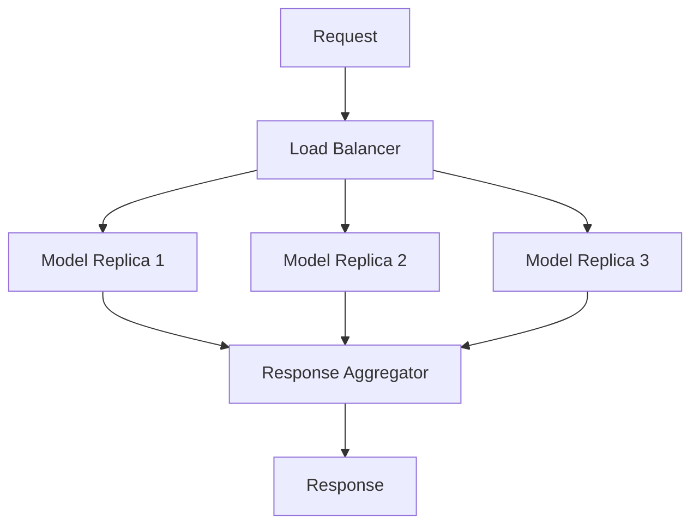

# MCP (Master Control Program): Optimizing LLM Performance and Efficiency

> This article is part of the [Full-Stack DevOps Cloud AI Complete Handbook](https://github.com/prodxcloud/fullstack-devops-cloud-ai-complete-handbook/), a comprehensive resource for modern software development, DevOps practices, cloud architecture, and AI integration. The complete source code and additional resources are available in the repository.

**Keywords**: MCP, master control program, LLM optimization, model quantization, inference optimization, GPU efficiency, distributed inference

> Learn advanced techniques for optimizing Large Language Models in production environments using the Master Control Program (MCP) architecture. This guide covers memory optimization, inference speed improvements, and scaling strategies.

## Table of Contents
- [Memory Optimization](#memory-optimization)
- [Inference Speed](#inference-speed)
- [GPU Utilization](#gpu-utilization)
- [Distributed Inference](#distributed-inference)
- [Caching Strategies](#caching-strategies)
- [Monitoring and Profiling](#monitoring-and-profiling)

## Memory Optimization

### Model Quantization Techniques


```python
def apply_dynamic_quantization(model: nn.Module) -> nn.Module:
    """Apply dynamic quantization to model."""
    
    # Configure quantization settings
    qconfig = torch.quantization.get_default_qconfig('fbgemm')
    
    # Prepare model for quantization
    model.qconfig = qconfig
    torch.quantization.prepare(model, inplace=True)
    
    # Convert to quantized model
    quantized_model = torch.quantization.convert(model)
    
    return quantized_model

def apply_static_quantization(
    model: nn.Module,
    calibration_data: Dataset
) -> nn.Module:
    """Apply static quantization with calibration."""
    
    qconfig = torch.quantization.get_default_qconfig('fbgemm')
    model.qconfig = qconfig
    
    # Prepare
    torch.quantization.prepare(model, inplace=True)
    
    # Calibrate
    with torch.no_grad():
        for batch in calibration_data:
            model(batch)
    
    # Convert
    quantized_model = torch.quantization.convert(model)
    
    return quantized_model
```

### Memory Management Strategies

```python
class ModelMemoryOptimizer:
    def __init__(self):
        self.gpu_memory = GPUMemoryTracker()
        self.model_cache = ModelCache()
    
    def optimize_memory(self, model: nn.Module):
        # Enable gradient checkpointing
        model.gradient_checkpointing_enable()
        
        # Use memory efficient attention
        model.config.use_cache = False
        
        # Enable flash attention if available
        if hasattr(model, "enable_flash_attention"):
            model.enable_flash_attention()
        
        # Monitor memory usage
        self.gpu_memory.track()
```

## Inference Speed

### Batch Processing Optimization


```python
class BatchProcessor:
    def __init__(self, model: nn.Module, batch_size: int = 32):
        self.model = model
        self.batch_size = batch_size
        self.queue = asyncio.Queue()
        
    async def process_batch(self, requests: List[str]) -> List[str]:
        batches = [
            requests[i:i + self.batch_size]
            for i in range(0, len(requests), self.batch_size)
        ]
        
        results = []
        for batch in batches:
            # Process batch in parallel
            batch_results = await asyncio.gather(
                *[self.process_single(req) for req in batch]
            )
            results.extend(batch_results)
            
        return results
```

### KV Cache Optimization

```python
class KVCache:
    def __init__(self, max_size: int = 1024):
        self.cache = {}
        self.max_size = max_size
        
    def get_cached_kv(
        self,
        layer_idx: int,
        batch_idx: int
    ) -> Optional[Tuple[torch.Tensor, torch.Tensor]]:
        key = (layer_idx, batch_idx)
        return self.cache.get(key)
        
    def update_cache(
        self,
        layer_idx: int,
        batch_idx: int,
        k: torch.Tensor,
        v: torch.Tensor
    ):
        key = (layer_idx, batch_idx)
        self.cache[key] = (k, v)
        
        if len(self.cache) > self.max_size:
            # Remove oldest entries
            oldest_key = next(iter(self.cache))
            del self.cache[oldest_key]
```

## GPU Utilization

### Multi-GPU Strategies


```python
class MultiGPUManager:
    def __init__(self, model: nn.Module, num_gpus: int):
        self.num_gpus = num_gpus
        self.model = self._distribute_model(model)
        
    def _distribute_model(self, model: nn.Module) -> nn.Module:
        if self.num_gpus > 1:
            model = nn.DataParallel(model)
        return model
        
    def optimize_gpu_usage(self):
        # Set optimal CUDA settings
        torch.backends.cudnn.benchmark = True
        torch.backends.cuda.matmul.allow_tf32 = True
        
        # Enable automatic mixed precision
        self.scaler = torch.cuda.amp.GradScaler()
        
    @torch.cuda.amp.autocast()
    def forward_pass(self, input_ids: torch.Tensor) -> torch.Tensor:
        return self.model(input_ids)
```

## Distributed Inference

### Load Balancing Architecture



### Implementation

```python
class DistributedInference:
    def __init__(self, model_replicas: List[str]):
        self.replicas = model_replicas
        self.load_balancer = RoundRobinBalancer(replicas)
        
    async def inference(self, prompt: str) -> str:
        # Select replica
        replica = self.load_balancer.next_replica()
        
        # Send request
        async with httpx.AsyncClient() as client:
            response = await client.post(
                f"{replica}/generate",
                json={"prompt": prompt}
            )
            
        return response.json()["text"]
```

## Caching Strategies

### Multi-Level Cache


```python
class MultiLevelCache:
    def __init__(self):
        self.l1_cache = LRUCache(1000)  # Local memory
        self.l2_cache = RedisCache()     # Redis
        self.l3_cache = S3Cache()        # S3
        
    async def get(self, key: str) -> Optional[str]:
        # Try L1
        if value := self.l1_cache.get(key):
            return value
            
        # Try L2
        if value := await self.l2_cache.get(key):
            self.l1_cache.set(key, value)
            return value
            
        # Try L3
        if value := await self.l3_cache.get(key):
            await self.l2_cache.set(key, value)
            self.l1_cache.set(key, value)
            return value
            
        return None
```

## Monitoring and Profiling

### Performance Metrics Dashboard


### Profiling Implementation

```python
class ModelProfiler:
    def __init__(self):
        self.prof = torch.profiler.profile(
            activities=[
                torch.profiler.ProfilerActivity.CPU,
                torch.profiler.ProfilerActivity.CUDA,
            ],
            schedule=torch.profiler.schedule(
                wait=1,
                warmup=1,
                active=3,
                repeat=2
            ),
            on_trace_ready=torch.profiler.tensorboard_trace_handler('./log'),
            record_shapes=True,
            profile_memory=True,
            with_stack=True
        )
    
    @contextmanager
    def profile_section(self, section_name: str):
        try:
            self.prof.start()
            yield
        finally:
            self.prof.stop()
```

## Performance Benchmarks

### Model Size vs Performance

| Model Size | Optimization          | Memory (GB) | Latency (ms) | Throughput |
|------------|----------------------|-------------|--------------|------------|
| 7B         | None                 | 14          | 250          | 20 req/s   |
| 7B         | 8-bit Quantization   | 7           | 280          | 18 req/s   |
| 7B         | 4-bit Quantization   | 3.5         | 320          | 15 req/s   |
| 13B        | None                 | 26          | 450          | 12 req/s   |
| 13B        | 8-bit Quantization   | 13          | 500          | 10 req/s   |
| 13B        | 4-bit Quantization   | 6.5         | 550          | 8 req/s    |

### Memory Usage Analysis


## Best Practices Summary

1. **Memory Optimization**
   - Use appropriate quantization
   - Enable gradient checkpointing
   - Implement efficient attention mechanisms

2. **Inference Speed**
   - Optimize batch processing
   - Use KV caching
   - Enable mixed precision

3. **GPU Utilization**
   - Implement multi-GPU strategies
   - Enable TF32 for computation
   - Use automatic mixed precision

4. **Distributed Inference**
   - Implement load balancing
   - Use model parallelism
   - Optimize communication

5. **Caching**
   - Implement multi-level caching
   - Use appropriate cache sizes
   - Monitor cache hit rates

## Resources
- [PyTorch Performance Tuning Guide](https://pytorch.org/tutorials/recipes/recipes/tuning_guide.html)
- [NVIDIA Deep Learning Performance Guide](https://docs.nvidia.com/deeplearning/performance/index.html)
- [Hugging Face Optimization Guide](https://huggingface.co/docs/transformers/performance)
- [Redis Caching Best Practices](https://redis.io/topics/lru-cache)

---

*This article is part of our comprehensive handbook on modern software development and AI integration. For the complete source code, additional examples, and related resources, visit our [GitHub Repository](https://github.com/prodxcloud/fullstack-devops-cloud-ai-complete-handbook/). We welcome contributions and feedback from the community.* 