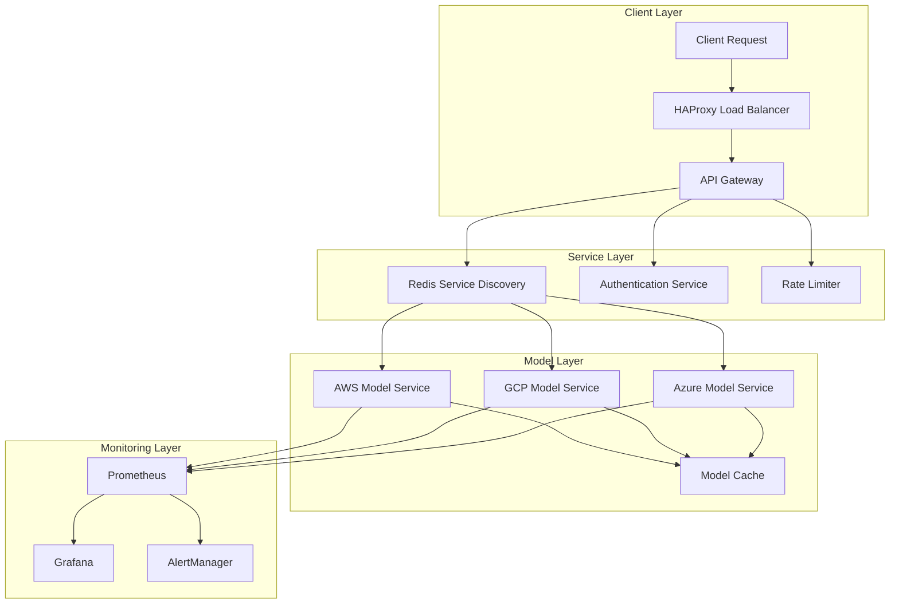

# Technical Deep Dive: Building a Multi-Cloud LLM Infrastructure

> This article is part of the [Full-Stack DevOps Cloud AI Complete Handbook](https://github.com/prodxcloud/fullstack-devops-cloud-ai-complete-handbook/), a comprehensive resource for modern software development, DevOps practices, cloud architecture, and AI integration. The complete source code and additional resources are available in the repository.

**Keywords**: LLaMA 2 implementation, GPU optimization, distributed systems, model serving, load balancing

> A technical deep-dive into the implementation details of our Multi-Cloud LLM Service. This article covers advanced topics including model optimization, distributed inference, and system architecture.

## System Architecture Deep Dive

### Detailed Component Architecture



## Model Service Implementation

### Model Loading and Optimization

```python
class LLaMAModelService:
    def __init__(self, model_path: str, device: str = "cuda"):
        self.device = device
        self.model = self._load_and_optimize_model(model_path)
        self.tokenizer = self._initialize_tokenizer(model_path)
        self.inference_cache = LRUCache(maxsize=1000)

    def _load_and_optimize_model(self, model_path: str):
        # Load model with optimizations
        model = AutoModelForCausalLM.from_pretrained(
            model_path,
            torch_dtype=torch.float16,
            device_map="auto",
            low_cpu_mem_usage=True
        )
        
        # Apply quantization
        model = quantize_model(model, bits=8)
        
        # Enable gradient checkpointing
        model.gradient_checkpointing_enable()
        
        return model

    def _initialize_tokenizer(self, model_path: str):
        return AutoTokenizer.from_pretrained(
            model_path,
            padding_side="left",
            truncation_side="left"
        )

    @torch.inference_mode()
    async def generate(
        self,
        prompt: str,
        max_tokens: int = 100,
        temperature: float = 0.7,
        cache_key: Optional[str] = None
    ) -> str:
        # Check cache first
        if cache_key and cache_key in self.inference_cache:
            return self.inference_cache[cache_key]

        # Tokenize with proper padding
        inputs = self.tokenizer(
            prompt,
            return_tensors="pt",
            padding=True,
            truncation=True,
            max_length=2048
        ).to(self.device)

        # Generate with optimized settings
        outputs = self.model.generate(
            inputs["input_ids"],
            max_new_tokens=max_tokens,
            temperature=temperature,
            do_sample=True,
            pad_token_id=self.tokenizer.eos_token_id,
            attention_mask=inputs["attention_mask"],
            use_cache=True
        )

        response = self.tokenizer.decode(
            outputs[0], 
            skip_special_tokens=True
        )

        # Cache the result
        if cache_key:
            self.inference_cache[cache_key] = response

        return response
```

## Load Balancing and Failover

### Smart Load Balancing Implementation

```python
class SmartLoadBalancer:
    def __init__(self):
        self.redis_client = Redis(host="redis", port=6379)
        self.metrics_client = PrometheusClient()
        
    async def get_optimal_provider(
        self,
        user_location: str,
        request_size: int
    ) -> str:
        providers = await self._get_available_providers()
        
        if not providers:
            raise NoAvailableProvidersError()
            
        weights = {}
        for provider in providers:
            weights[provider] = await self._calculate_provider_weight(
                provider,
                user_location,
                request_size
            )
            
        return max(weights.items(), key=lambda x: x[1])[0]
        
    async def _calculate_provider_weight(
        self,
        provider: str,
        user_location: str,
        request_size: int
    ) -> float:
        # Get provider metrics
        latency = await self._get_provider_latency(provider)
        cost = await self._get_provider_cost(provider, request_size)
        load = await self._get_provider_load(provider)
        geo_proximity = await self._calculate_geo_proximity(
            provider,
            user_location
        )
        
        # Calculate weighted score
        return (
            0.4 * (1 - normalize(latency)) +
            0.3 * (1 - normalize(cost)) +
            0.2 * (1 - normalize(load)) +
            0.1 * normalize(geo_proximity)
        )
```

## Performance Optimization

### Memory Management

```python
class ModelMemoryManager:
    def __init__(self, max_memory_gb: float = 24.0):
        self.max_memory = max_memory_gb * 1024 * 1024 * 1024  # Convert to bytes
        self.current_memory = 0
        self.model_cache = {}
        
    def can_load_model(self, model_size: int) -> bool:
        return self.current_memory + model_size <= self.max_memory
        
    def load_model(self, model_id: str, model_size: int):
        if not self.can_load_model(model_size):
            self._free_memory(model_size)
        # Load model implementation...
        
    def _free_memory(self, required_size: int):
        while not self.can_load_model(required_size):
            lru_model = self._get_least_recently_used()
            self._unload_model(lru_model)
```

## Monitoring and Metrics

### Custom Prometheus Metrics

```python
# Initialize metrics
MODEL_INFERENCE_LATENCY = Histogram(
    'model_inference_latency_seconds',
    'Time spent on model inference',
    ['model', 'provider', 'quantization']
)

MODEL_MEMORY_USAGE = Gauge(
    'model_memory_usage_bytes',
    'Current model memory usage',
    ['model', 'provider']
)

INFERENCE_QUEUE_SIZE = Gauge(
    'inference_queue_size',
    'Number of requests in the inference queue',
    ['provider']
)

# Example usage in code
@contextlib.contextmanager
def track_inference_latency(model: str, provider: str, quantization: str):
    start_time = time.time()
    try:
        yield
    finally:
        duration = time.time() - start_time
        MODEL_INFERENCE_LATENCY.labels(
            model=model,
            provider=provider,
            quantization=quantization
        ).observe(duration)
```

## Security Implementation

### Authentication and Authorization

```python
from fastapi import Security, HTTPException
from fastapi.security import HTTPBearer, HTTPAuthorizationCredentials

class SecurityManager:
    def __init__(self):
        self.auth_scheme = HTTPBearer()
        self.redis_client = Redis(host="redis", port=6379)
        
    async def authenticate(
        self,
        credentials: HTTPAuthorizationCredentials = Security(HTTPBearer())
    ) -> dict:
        if not credentials:
            raise HTTPException(401, "Not authenticated")
            
        token = credentials.credentials
        user_data = await self._validate_token(token)
        
        if not user_data:
            raise HTTPException(401, "Invalid token")
            
        return user_data
        
    async def authorize(self, user_data: dict, required_role: str) -> bool:
        user_role = user_data.get("role", "")
        return self._check_role_permissions(user_role, required_role)
```

## Deployment Configurations

### Kubernetes Deployment

```yaml
apiVersion: apps/v1
kind: Deployment
metadata:
  name: llama-model-service
spec:
  replicas: 3
  selector:
    matchLabels:
      app: llama-model
  template:
    metadata:
      labels:
        app: llama-model
    spec:
      containers:
      - name: model-service
        image: llama-model:latest
        resources:
          limits:
            nvidia.com/gpu: 1
            memory: "32Gi"
          requests:
            memory: "16Gi"
        env:
        - name: MODEL_PATH
          value: "/models/llama2"
        - name: REDIS_URL
          value: "redis://redis:6379"
        volumeMounts:
        - name: model-storage
          mountPath: /models
      volumes:
      - name: model-storage
        persistentVolumeClaim:
          claimName: model-storage-pvc
```

## Advanced Topics

### Model Quantization Details

```python
def quantize_model(model: nn.Module, bits: int = 8) -> nn.Module:
    """Quantize model weights to reduce memory footprint."""
    
    def _quantize_layer(layer: nn.Module):
        if isinstance(layer, nn.Linear):
            # Quantize weights
            scale = layer.weight.abs().max() / (2**(bits-1) - 1)
            layer.weight.data = torch.round(layer.weight.data / scale) * scale
            
            # Quantize biases if present
            if layer.bias is not None:
                scale = layer.bias.abs().max() / (2**(bits-1) - 1)
                layer.bias.data = torch.round(layer.bias.data / scale) * scale
    
    model.apply(_quantize_layer)
    return model
```

### Caching Strategy


```python
class DistributedCache:
    def __init__(self):
        self.local_cache = LRUCache(maxsize=1000)
        self.redis_client = Redis(host="redis", port=6379)
        
    async def get(self, key: str) -> Optional[str]:
        # Try local cache first
        if value := self.local_cache.get(key):
            return value
            
        # Try Redis cache
        if value := await self.redis_client.get(key):
            self.local_cache[key] = value
            return value
            
        return None
        
    async def set(
        self,
        key: str,
        value: str,
        ttl: int = 3600
    ):
        # Set in both caches
        self.local_cache[key] = value
        await self.redis_client.setex(key, ttl, value)
```

## Resources and References

### Performance Benchmarks
| Model Size | Quantization | Memory Usage | Latency (p95) | Throughput |
|------------|--------------|--------------|---------------|------------|
| 7B         | None         | 14GB         | 250ms        | 20 req/s   |
| 7B         | 8-bit        | 7GB          | 280ms        | 18 req/s   |
| 13B        | None         | 26GB         | 450ms        | 12 req/s   |
| 13B        | 8-bit        | 13GB         | 500ms        | 10 req/s   |

### Additional Resources
- [LLaMA 2 Paper](https://arxiv.org/abs/2307.09288)
- [Quantization Guide](https://pytorch.org/docs/stable/quantization.html)
- [NVIDIA Triton Inference Server](https://github.com/triton-inference-server/server)
- [Redis Cluster Guide](https://redis.io/topics/cluster-tutorial)

---

*This article is part of our comprehensive handbook on modern software development and AI integration. For the complete source code, additional examples, and related resources, visit our [GitHub Repository](https://github.com/prodxcloud/fullstack-devops-cloud-ai-complete-handbook/). We welcome contributions and feedback from the community.* 